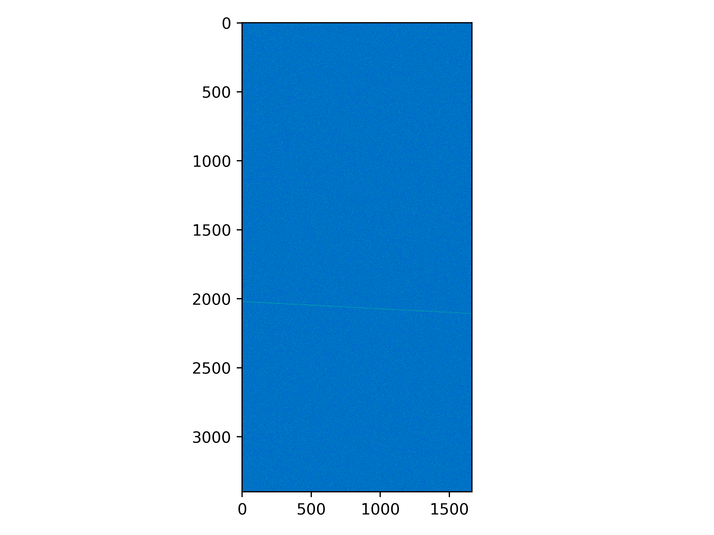
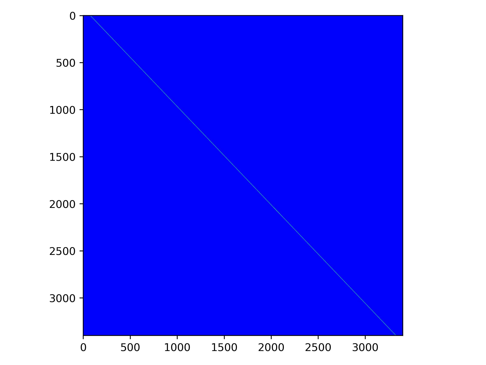

# Faint Tracks

This is a general document about the overall design of the faint tracks program.

## Overall design

The simulation and detection of tracks is broken into four steps:

1. Generate noise
2. Simulate a crossing mCP
3. Sum total charge across lines
4. Find peak in sums

### 1. Generate Noise

##### gen_noise, shuffle_noise

The noise generation is taken from sbndcode, specifically `SBNDuBooNEDataDrivenNoiseService_service.cc.` The noise is
independent along each wire. For each wire, a frequency spectrum is generated, and then inverse fourier transformed to
get the noise.

Because `ifft`-ing a 3400 element long array 1664 times is relatively slow (~15ms), we don't want to do this "true"
simulation of the noise for every single event. Instead, we use each "true" noise array 10 times (no specific reason
it's 10), but for each subsequent time its used, it is first shuffled. This is done in two ways. First, since each wire
has independent noise, we shuffle the order of the wires. Second, we roll the array of noise values for each wire by a
random amount - ie, push the array up by `n` indices, then for the part that would be outside the range of the array,
put those back in the front (
like [`np.roll`](https://numpy.org/doc/stable/reference/generated/numpy.roll.html#numpy.roll)).

This section of the algorithm takes ~4 ms on average, with 1 `gen_noise` taking ~20 ms and the following 9
`shuffle_noise` taking ~2 ms each.

### 2. Simulate a crossing mCP

##### simulate_track

As an input to this function, the points defining a line across the detector are needed. Currently, the line always
passes through the entire detector in the beam direction. The `get_start_end_pairs` is used to generate the start and
end point (tick at wire=0 and at wire=1663 respectively) of this line, which will always point back to the target. It
first randomly picks the end point, then uses lines to the top/bottom of the target to find the bounds on the point on
the start of the detector. See [these calculations](images/details/delta_t_calculation.png) to see the math worked out.

This line is then discretized, and at each point an interaction is simulated. A number of ionization electrons is
calculated based on an energy loss sampled from a Landau distribution. This shower of electrons is then propagated to
the readout plane, where it is converted to adcs at each point an electron reaches.

Because this step is less parallel than the rest of the program, it has a more complicated structure. This function has
to create a `(1664, 3400)` array and write the results of each simulation step into that array. Since the shower from
multiple steps can overlap, we have to take care that there are no data races while we still want each simulation step
to be as parallel as possible. To do this, 128 (`CHUNKS`) copies of this array are created, and each simulation step
picks one of those to write into. Then, all 128 copies are summed to create one array storing all the track information,
which is then added to the noise to create the full event.

This is the most time intensive section, taking ~26 ms. Part of the optimization of this section involves optimizing
`CHUNKS`. My results from doing so are shown in [this plot](images/details/benchmark_n_chunks.png), showing the time to
generate all n partially-filled arrays in blue, the time to sum n arrays into 1 final array in orange, and the total
time in green. I found 128 is best, but this number will be different for different values of `n_steps`, so be sure to
test different values if you change `n_steps`
(``for i in `seq 50 300`; do python faint_tracks.py $c 32 --mode chunks; done``).

The event array after this step:

### 3. Sum total charge across lines

##### track_sums

With an event containing both the noise and (at least) one track, we work on finding that track. This section is fairly
simple, using a gpu implementation of the algorithm used by `skimage.draw.line_aa` to get the coordinates in the array
along a given line and total the values at those coordinates.

Calculating all 3400² (11,560,000) totals is still a lot, and takes on the order of seconds to complete. So, the two-hit
method is used to limit how many lines need to be totaled by ignoring lines which don't point back to the target. Based
on how much tolerance is given around the target, the maximum number of ticks separating the first start tick that
points to the target from the last start tick that points to the target for any possible end tick is calculated when the
program starts (for `min,max=82,88`, this is `6`). Then, this function is able to, for each end tick from 0 to 3400,
just calculate the sums on just the 6 lines pointing back to the target. This is few enough that the whole calculation
fits onto the GPU at once.

This section takes ~5 ms. A large part of optimizing this section is choosing the optimal number of threads per block
and blocks per grid. In my testing, 32 threads per block was optimal, but if `tick_separation` changes (due to the
geometry changing enough), other values will have to be tested
(``for t in `seq 10 150`; do python faint_tracks.py 128 $t --mode threads; done``).

The sums array after this step:

### 4. Find peak in sums

##### cucim.skimage.feature.peak_local_max

This is very simple from our perspective, just call the gpu version of `scipy`'s `peak_local_max`.

This function takes ~8.5 ms. This can definitely be improved, as it is currently looking at the entire `(3400, 3400)`
sums array, when only 6 entries in each row are nonzero.

## GPU Performance Notes

### General

One big thing to avoid is copying memory between the host (cpu) and device (gpu). This program avoids that except for
one copy of all the start/end point pairs before the rest of the program starts. Other than that, the noise is generated
on the GPU, and all subsequent data is allocated/processed on the GPU, until the peak that `peak_local_max` found (2
`float32`'s) is copied back to the host.

Prefer using single precision floats (`cp.float32`) over double precision floats (the built in `float` type,
`cp.float64`) because it is much faster. Note that python's type ascriptions (like `x: cp.float32`) doesn't actually do
anything, just reminds us that that variable *should* be a `cp.float32`. Use the `dtype` argument on `cp` and `np`
arrays to set the data type.

### `@cuda.jit` vs `@cp.fuse`

Numba's [`@cuda.jit`](https://numba.readthedocs.io/en/stable/cuda/kernels.html) decorator is used to write
arbitrary cuda kernels, which can take any arguments and don't return anything but instead modify one of
the input arrays passed in. When called, you have to specify how many blocks per grid and threads per block will be
launched. You can also specify `device=True` in this decorator to write a device function which can be called from one
of these kernel (`@njit` will also do this, and the function will also be usable from python).

Cupy's [`@cp.fuse`](https://docs.cupy.dev/en/stable/user_guide/kernel.html#kernel-fusion) decorator is used to easily
write a cuda kernel that operates on each argument elementwise like how np ufuncs work. When possible, this is preferred
over `@cuda.jit` because it tends to generate faster code, but it isn't always able to be used since it's less flexible.

Additionally, in the `numba.cuda` vs `cupy` usages, both libraries can be used to allocate memory and generate random
numbers, but `cupy` should be used when possible as it is generally faster (and often more convenient). For allocating
memory, `cupy` has functions that mirror `numpy`'s array creation apis, so it's very easy to use & know what is
possible. Also, `cupy` allocates to a memory pool that it manages, whereas `numba` allocates to globally managed memory, 
which makes `cupy` a bit more efficient for re-allocation. Additionally, the `cupy` random number generation has methods
for a lot of distributions and is faster than `numba`'s (which just has methods for uniform and normal distributions).
The `cp` random functions also have access to a global rng state if not given to them explicitly. The upside of 
`numba`'s rng is that it is a device function, rather than a kernel, meaning it can be used inside cuda kernels. This 
means that it can be used to generate random numbers when the parameters aren't know before entering a kernel.

### Pre-allocating `event_arrays_d`

The `event_arrays_d` array, used to hold the 128 partial track arrays, is allocated once at the start of the program
and zeroed each time `simulated_track` is used. This doesn't directly have an effect on the speed of the program, but
it prevents the program from using as much memory since it wouldn't reuse the memory for this array otherwise (and it's
about 3 GB) for some reason.

### Passing cp.random.RandomState to each function

All of the `cp` random functions can be run as the global function `cp.random.*` or as methods on 
`cp.random.RandomState`. The global functions will share a global `RandomState`, but this does not seem to be any slower
than manually passing a `RandomState` to each function (perhaps, having multiple `RandomState`s would be faster? so that
a second rng function could be launched without having to wait for the first to get the `RandomState` back). The upside
to passing the `RandomState` around is that when it is initialized, the generator used can be chosen, incase one of the
other generators is faster than the default. Last I tested, the default is fastest, but different methods are faster for
different types being generated, so this could be retested.

### Optimization techniques

Time with `perf_counter_ns` - this is good for identifying what macro scale parts of the program are slow, but not for
benchmarking individual parts. Additionally, because calling a cuda kernel just launches it but doesn't wait for it to
finish, `cuda.syncronize()` must be called before getting the time with this method, to wait until the kernel is done
running. Otherwise, you will just time how long it takes to tell the GPU to run the kernel, aka basically nothing.

Use [NVIDIA Nsight Compute](https://docs.nvidia.com/nsight-compute/NsightComputeCli/index.htm) to profile every cuda
call made. When running `ncu`, make sure to run with `--mode profile` so that it doesn't run a bunch of iterations,
since each cuda function becomes much slower when being profiled.

### Useful resources:

* Numba cuda docs: https://numba.readthedocs.io/en/stable/cuda/index.html
* Cupy docs: https://docs.cupy.dev/en/stable/user_guide/basic.html
* Super good tutorial, esp parts 1, 2, 5 for us: https://github.com/numba/nvidia-cuda-tutorial
* NVIDIA compute capabilities: https://docs.nvidia.com/cuda/cuda-c-programming-guide/index.html#features-and-technical-specifications-technical-specifications-per-compute-capability
* Numba cuda examples:
  1. https://towardsdatascience.com/cuda-by-numba-examples-1-4-e0d06651612f
  2. https://towardsdatascience.com/cuda-by-numba-examples-215c0d285088
  3. https://towardsdatascience.com/cuda-by-numba-examples-7652412af1ee
  4. https://towardsdatascience.com/cuda-by-numba-examples-c583474124b
* NVIDIA cuda training series (for C++, but principles still relevant) (I haven't actually looked through all of these,
  but it looked good): https://www.olcf.ornl.gov/cuda-training-series/
